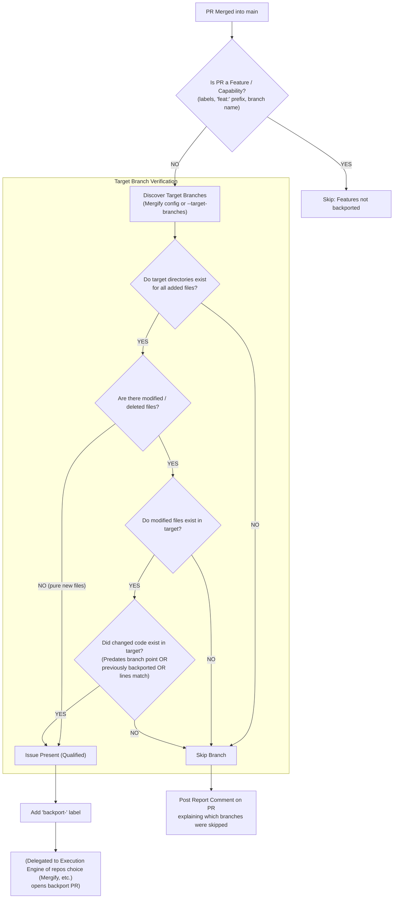

# Retrobranch

**Pre-flight decision engine for backport eligibility and triggering.**

Retrobranch acts as a pre-flight qualification layer for backport automation. Before bots attempt to cherry-pick commits into release branches, Retrobranch verifies whether a merged PR is a bug fix (rather than a feature) and determines whether the defect or code being patched **actually exists** in each given maintained target branch.

> [!NOTE]
> **Merged PR/MR Focus:** Retrobranch exclusively evaluates **merged Pull/Merge Requests (PRs/MRs)** rather than raw git commits. Merged PRs have undergone a review process, establishing a level of trustworthiness and providing rich metadata (PR title, labels, head branch name) essential for accurate backport qualification.

## Table of contents

- [The problem](#the-problem)
- [Usage](#usage)
  - [🚀 Usage in GitHub Actions](#-usage-in-github-actions)
  - [Local CLI installation & usage](#local-cli-installation--usage)
  - [Building PyPI distributions](#building-pypi-distributions)
- [⚙️ Configuration & inputs](#%EF%B8%8F-configuration--inputs)
  - [GitHub Action inputs](#github-action-inputs)
- [Architecture: Qualification vs. execution](#architecture-qualification-vs-execution)
  - [Qualification logic & rationale](#qualification-logic--rationale)
  - [Why GitHub CLI (`gh`) and authentication are required](#why-github-cli-gh-and-authentication-are-required)
  - [Generic maintained branch sources](#generic-maintained-branch-sources)
    - [Python API example](#python-api-example)
- [Running tests](#running-tests)
- [License](#license)

## The problem

Some backporting tools e.g., Mergify, `backport-action`, `git-backporting`, are execution engines: they execute cherry-picks and open pull requests whenever a triggering label on a pull request page is attached (label may reads e.g. `backport-X` where X is the target branch name). The steps in backporting that might not be covered by those tools are:
1. *Should this PR be backported at all?* (e.g., skipping features, breaking changes, dependency bumps).
2. *Does the bug/problem actually exist in the target/release branch `X`?* If a bug was in code added to `main` 6 months after `branch-previous` split off, cherry-picking it to `branch-previous` will either fail with merge conflicts or corrupt the older release.

Without Retrobranch, maintainers must manually investigate commit histories and apply backport labels by hand.

## Usage
### 🚀 Usage in GitHub Actions

Use Retrobranch directly in your repository's workflow (e.g. `.github/workflows/auto_backport.yaml`):

```yaml
name: Auto Backport Labeler

on:
  pull_request_target:
    types:
      - closed
  workflow_dispatch:
    inputs:
      pr_number:
        description: "PR number to evaluate"
        required: true
        type: number
      filter_branches:
        description: "Optional comma-separated branch filter (e.g. 'release-2.0,release-1.0')"
        required: false
        default: ""
        type: string
      dry_run:
        description: "Dry run (evaluate without adding labels or comments)"
        required: false
        default: false
        type: boolean

permissions:
  pull-requests: write
  contents: read
  issues: read

jobs:
  qualify-backports:
    if: >
      github.event_name == 'workflow_dispatch' ||
      (github.event.pull_request.merged == true && github.event.pull_request.base.ref == 'main')
    runs-on: ubuntu-24.04
    steps:
      - name: Checkout repository
        uses: actions/checkout@v4
        with:
          ref: ${{ github.event_name == 'pull_request_target' && 'main' || '' }}
          fetch-depth: 0

      - name: Evaluate PR and Apply Backport Labels
        uses: kinu-garage/retrobranch@main
        with:
          pr-number: ${{ github.event.pull_request.number || inputs.pr_number }}
          filter-branches: ${{ inputs.filter_branches }}
          mergify-config: ".github/mergify.yml"
          dry-run: ${{ inputs.dry_run || false }}
          github-token: ${{ secrets.GITHUB_TOKEN }}
```

---

### Local CLI installation & usage

Retrobranch can be installed locally as a PyPI package or built into standard distribution formats (`.whl` and `.tar.gz`). It is recommended to install into a Python virtual environment (`venv`). The CLI executable is named **`retrobr`** (with `retrobranch` maintained as an alias):

Insallation:

```bash
# Clone and navigate to the repository
git clone https://github.com/kinu-garage/retrobranch.git
cd retrobranch

# Create and activate a virtual environment
python3 -m venv .venv
source .venv/bin/activate  # On Windows: .venv\Scripts\activate

# Install locally in editable mode
pip install -e .

export GH_TOKEN=$(gh auth token)
```
Command samples:
```bash
# Evaluate by PR number using retrobr executable
# Find the given #PR in the remote of the local repo.
cd %YOUR_LOCAL_REPO%
retrobr 1234 --dry-run

# Or evaluate by full GitHub PR URL. You don't need to be in the local repo of the remote repo in the command arg.
retrobr https://github.com/owner/repo/pull/1234 --dry-run

# Custom target branches or config file
retrobr 1234 --target-branches "release-2.0,release-1.0" --dry-run
retrobr -p 1234 --config-file .github/maintained_branches.yml --dry-run

# Custom backport label pattern (default: 'backport-{branch}')
retrobr 1234 --label-template "cherry-pick:{branch}" --dry-run
retrobr 1234 --label-template "bp/{branch}" --dry-run
```

### Building PyPI distributions

To build PyPI standard Wheel (`.whl`) and Source Distribution (`.tar.gz`) packages for local distribution or publishing:

```bash
pip install build
python3 -m build
# Built artifacts created in dist/retrobranch-0.1.0-py3-none-any.whl and dist/retrobranch-0.1.0.tar.gz
```

## ⚙️ Configuration & inputs

### GitHub Action inputs

| Input | Description | Required | Default |
| :--- | :--- | :---: | :--- |
| `pr-number` | Pull request number to evaluate | **Yes** | — |
| `commit` | PR merge commit SHA | No | *(auto-detected)* |
| `base-branch` | Target base branch PR was merged into | No | *(auto-detected from repo / config / `main`)* |
| `target-branches` | Comma-separated list of target branches (e.g. `release-1.0,release-2.0`) | No | `""` |
| `filter-branches` | Comma-separated list to filter candidate branches | No | `""` |
| `config-file` | Path to branch configuration file (Mergify YAML, generic YAML/JSON, or text) | No | `""` |
| `source-type` | Format type for `config-file` (`auto`, `mergify`, `yaml`, `json`, `text`) | No | `auto` |
| `mergify-config` | Legacy path to Mergify configuration file (alias for `config-file`) | No | `""` |
| `dry-run` | Evaluate without modifying labels or commenting | No | `false` |
| `label-template` | Template pattern for backport labels (supports `{branch}`, `{target}`, `%s`) | No | `backport-{branch}` |
| `github-token` | GitHub token for CLI / API calls | No | `${{ github.token }}` |

## Architecture: Qualification vs. execution

Retrobranch sits *upstream* of your backport execution bot:



### Qualification logic & rationale

Retrobranch evaluates PRs for backporting using a two-stage qualification process:

#### 1. Stage 1: Feature classification (upfront filter)
Before inspecting code diffs, Retrobranch evaluates PR metadata (title prefixes like `feat:`, labels like `enhancement`, and head branch names like `feat/*`).
* **Features are skipped upfront** across all target branches.
* **Rationale**: Backports are reserved for bug fixes and maintenance patches. Eliminating feature PRs upfront ensures that newly added files in bugfix PRs (such as new unit test cases or missing patch configs) are trusted as valid parts of a fix.

#### 2. Stage 2: Target branch verification & file ancestry
For PRs classified as bug fixes or maintenance patches:
* **Newly Added Files (`A`)**: Line-ancestry checks (`git blame`) only apply to pre-existing code being modified or deleted. For brand-new files, Retrobranch verifies that the file's parent directory exists in target branch `X`. If the directory exists, adding the new file is safe; if the directory is missing, backporting to that branch is skipped.
* **Modified / Deleted Files (`M` / `D`)**: Verifies that modified files exist in target branch `X`, and uses `git blame` and merge-base ancestry to confirm that the lines being patched actually existed when target branch `X` split off (or were previously backported).

### Why GitHub CLI (`gh`) and authentication are required

Retrobranch relies on the **GitHub CLI (`gh`)** for API operations, and requires authentication (`GH_TOKEN` or `gh auth login`).

#### 1. Why GitHub CLI (`gh`) is needed
While local Git tracks code history and diffs, GitHub-specific pull request metadata is not stored in the local Git repository. Retrobranch requires `gh` to:
* **Fetch PR's metadata**: Retrieve PR title (e.g. `feat:` vs `fix:`), attached labels, head branch name (`feat/*`), merge commit SHA, target base branch, and merge status.
* **Apply backport labels**: Automatically attach `backport-<branch>` labels (TBD if user can specify the name of the labels) to qualified PRs on GitHub so execution bots (e.g. Mergify) open backport PRs.
* **Post report comments**: Post verification summary reports directly onto the PR explaining which branches were skipped.

#### 2. Why authentication is required
* **GitHub API rate limits & access**: Querying PR metadata via GitHub APIs requires an authenticated GitHub token (`GH_TOKEN` or `github.token` in Actions).
* **Write permissions**: Modifying PR labels (`gh pr edit`) and posting comments (`gh pr comment`) requires write permissions on pull requests.
* **Private repository support**: Fetching PR metadata on private or enterprise repositories requires an authenticated session.

### Generic maintained branch sources

Retrobranch supports multiple pluggable sources for discovering maintained target branches:

1. **Explicit Branch List**: Provided via `--target-branches "release-2.0,release-1.0"` or `ExplicitBranchSource`.
2. **Mergify YAML Configuration**: Auto-detected or via `MergifyBranchSource`.
3. **Generic YAML / JSON Config**: Any YAML/JSON file containing a list or dictionary with keys like `maintained_branches`, `target_branches`, `branches`, or `backport_branches`.
4. **Plain Text Files**: Line-separated list of branch names (`#` lines treated as comments).
5. **Custom Python Callables / Classes**: Custom sources implementing `BaseBranchSource` or returning `list[str]`.
6. **Composite Sources**: Combine multiple discovery sources seamlessly.

### Python API example

```python
from retrobranch import get_maintained_branches, BaseBranchSource, GenericFileBranchSource

# Custom source implementation
class DatabaseBranchSource(BaseBranchSource):
    def get_branches(self):
        return ["release-1.0", "release-2.0"]

# Discover branches combining file and custom sources
branches = get_maintained_branches(
    config_path=".github/maintained_branches.yml",
    sources=[DatabaseBranchSource()],
)
```

## Running tests

Retrobranch includes a full unit test suite that tests classification, branch discovery, and ancestry heuristics in `<0.01s` without requiring tokens or network access:

```bash
python3 tests/test_retrobranch.py
```

## License

Retrobranch is licensed under the [Apache License 2.0](LICENSE).

EoF